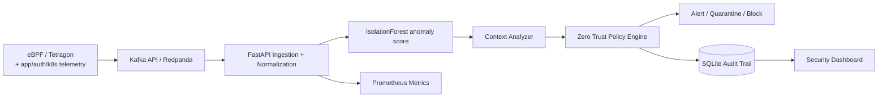

# AI-Driven Cloud-Native Security Platform

Runnable interview/POC implementation of the architecture described in The Talent Grid project: telemetry collection, Kafka-compatible streaming, anomaly scoring, context generation, Zero-Trust policy decisions, staged enforcement, audit history, metrics, and Kubernetes/Tetragon deployment assets.

## Architecture



## What is implemented

- `POST /v1/telemetry`: asynchronous event ingestion through Redpanda/Kafka.
- `POST /v1/evaluate`: direct synchronous evaluation for quick tests.
- ML anomaly detection with Isolation Forest plus high-confidence security signals.
- Context-analysis layer that produces investigation context and playbook recommendations without requiring an external LLM key.
- Zero-Trust staged policy: allow → alert → quarantine → block.
- Safety default: enforcement is simulated; high-risk actions require approval when configured.
- SQLite audit trail; dashboard at `/`; API docs at `/docs`; Prometheus metrics at `/metrics`.
- Kubernetes Deployment, Service and HPA manifest.
- Monitor-only Tetragon `TracingPolicy` example.
- Unit tests for normal and malicious paths.

## Run with Docker

```bash
docker compose up --build -d
python -m pip install httpx
python producer/simulator.py --count 20
```

Open:

- Dashboard: `http://localhost:8080`
- Swagger: `http://localhost:8080/docs`
- Redpanda Console: `http://localhost:8081`
- Metrics: `http://localhost:8080/metrics`

Stop:

```bash
docker compose down -v
```

## Run without Kafka

```bash
python -m venv .venv
source .venv/bin/activate        # Windows Git Bash: source .venv/Scripts/activate
pip install -r requirements.txt
USE_KAFKA=false DB_PATH=./security.db uvicorn app.main:app --reload --port 8080
python producer/simulator.py --direct --count 20
```

## Kubernetes / Tetragon

1. Build and push the image, then replace `your-registry/ai-security-platform:1.0.0` in `k8s/security-api.yaml`.
2. Deploy your Kafka-compatible broker and set `KAFKA_BOOTSTRAP` accordingly.
3. Apply `k8s/security-api.yaml`.
4. Install Tetragon using its official Helm instructions.
5. Apply the monitor-only policy: `kubectl apply -f tetragon/observe-runtime.yaml`.
6. Add a small adapter that maps Tetragon JSON events into the `TelemetryEvent` schema and posts them to `/v1/telemetry`.

The included HPA targets 65% CPU and scales from 2 to 10 API pods. Production deployments should use queue lag and inference latency as additional/custom scaling signals.

## Production hardening backlog

- Signed/versioned model artifacts and model registry.
- KMS-backed secrets and envelope encryption.
- OIDC workload identity + fine-grained RBAC.
- Real threat-intelligence enrichment and IOC expiry.
- Feature store/time-series/object storage.
- Dedicated policy service (OPA-compatible) with signed policy bundles.
- Human approval workflow for disruptive controls.
- Real firewall, identity and Tetragon enforcement adapters behind change controls.
- Drift monitoring, canary models/policies, chaos tests and SLO dashboards.
- LLM provider adapter with prompt/response auditing, redaction and cost/latency budgets.

## Interview demo storyline

1. Start the stack and show an empty dashboard.
2. Run the simulator. Most baseline events are allowed or alerted.
3. Every seventh event is intentionally suspicious: IOC hit, privileged context, repeated auth failures, unusual port and large egress.
4. Show the risk score, evidence, recommended block/quarantine action and simulated enforcement status.
5. Open Redpanda Console to prove the event-driven ingestion path.
6. Open `/metrics` to discuss p95 latency, throughput and alert/action counters.
7. Open the Kubernetes HPA and Tetragon policy files to explain scale and runtime visibility.
8. Explain why high-risk controls are staged/approval-gated to prevent false positives from disrupting production.
