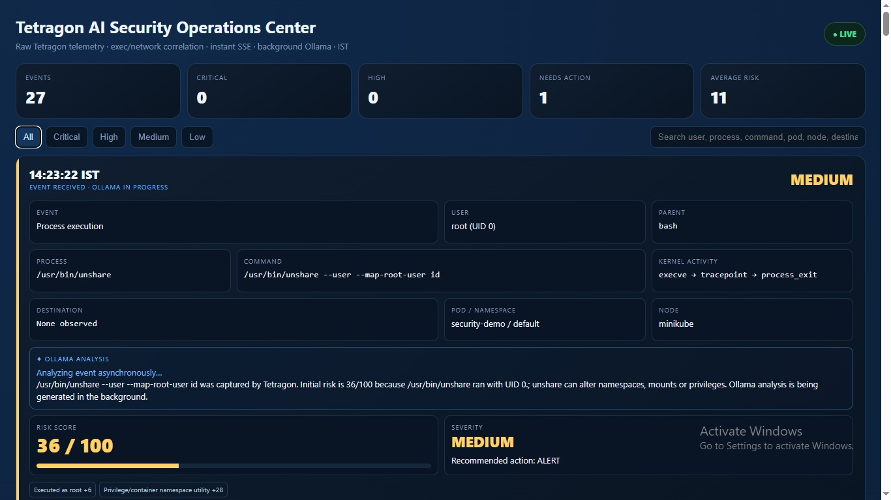
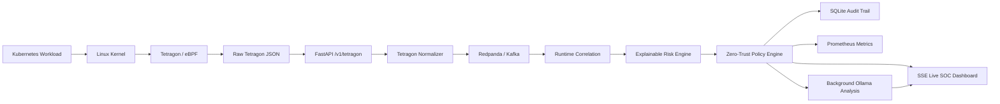

# AI-Driven Cloud-Native Security Platform for Real-Time Threat Detection and Zero-Trust Enforcement

A real-time Kubernetes Security Operations Center that captures runtime activity with **Tetragon/eBPF**, preserves process and Kubernetes context, calculates an explainable risk score, streams events instantly to the SOC dashboard, enriches detections with **Ollama**, and applies staged Zero-Trust response decisions.

## Project Demo



The SOC dashboard presents each runtime event with the information an analyst needs to understand and prioritize activity quickly:

- IST event timestamp
- Event classification
- User / UID
- Parent process
- Executed process
- Full command and arguments
- Kernel activity observed by Tetragon
- Network destination when network evidence exists
- Kubernetes cluster, node, namespace and pod context
- Explainable risk factors
- Risk score on a 0–100 scale
- Severity
- Recommended Zero-Trust action
- Background Ollama analysis

## What the Platform Does

The platform continuously observes Kubernetes runtime behavior and turns low-level Tetragon events into SOC-ready security detections.

Tetragon captures process execution and kernel activity directly from the Linux kernel through eBPF. The platform receives the original Tetragon JSON, normalizes it without inventing telemetry, correlates related process and network activity through Tetragon execution identifiers, calculates an explainable risk score, and pushes the event to the dashboard immediately.

Ollama runs as an asynchronous enrichment layer. The SOC card appears before LLM inference completes, and the same event is updated when the final explanation is ready. Slow LLM inference therefore does not delay Tetragon ingestion or the live dashboard.

## Current Architecture



## Real-Time Event Flow

```text
Kubernetes command
      ↓
Linux kernel
      ↓
Tetragon / eBPF
      ↓
Raw Tetragon JSON
      ↓
POST /v1/tetragon
      ↓
Normalization
      ↓
Redpanda / Kafka
      ↓
Risk scoring + policy decision
      ↓
SSE → SOC dashboard immediately
      ↓
Ollama analysis in background
      ↓
Same dashboard card is enriched
```

## Tetragon Context Preserved by the Platform

The normalizer preserves the security context exposed by Tetragon, including:

```text
exec_id
parent_exec_id
binary
arguments
cwd
pid
uid
parent binary
parent arguments
pod
namespace
container
node
source IP
source port
destination IP
destination port
kernel function / tracing policy
raw Tetragon event
```

Network fields remain empty when the event contains no network evidence. The platform does not assign synthetic IP addresses, ports, byte counts or malicious indicators to ordinary process events.

## Process and Network Correlation

Tetragon can generate separate events for a process execution and the kernel operations produced by that process.

The platform correlates these records using Tetragon execution identity so a command such as:

```bash
curl -I https://hackveda.in
```

can progress from:

```text
PROCESS_EXEC
/usr/bin/curl -I https://hackveda.in
```

to a richer SOC event when a related TCP connection is observed:

```text
EVENT
Outbound command execution

PARENT
bash

PROCESS
/usr/bin/curl

COMMAND
/usr/bin/curl -I https://hackveda.in

KERNEL ACTIVITY
execve → connect

DESTINATION
hackveda.in:443 / observed destination IP
```

The browser updates the original event card instead of presenting disconnected records.

## Explainable Risk Scoring

The platform uses an event-aware security risk engine rather than presenting an uncalibrated anomaly-model output as attack probability.

Each score represents **SOC investigation priority on a 0–100 scale**.

Examples of observable factors include:

- execution as UID 0
- shell execution
- discovery commands
- network-capable utilities
- execution from writable temporary paths
- namespace and privilege-changing utilities such as `unshare` and `nsenter`
- sensitive system or Kubernetes paths
- download-and-execute command chains
- application processes spawning shells
- public network egress
- unusual destination ports
- trusted known-malicious indicators
- multiple correlated security signals

The dashboard displays the contributing factors beside each detection so the analyst can see why the score increased.

### Example

For:

```bash
/usr/bin/unshare --user --map-root-user id
```

the current dashboard can identify factors such as:

```text
Base observation                     2
Executed as root                    +6
Privilege/container namespace tool +28
                                    ---
Risk                                36 / 100
Severity                            MEDIUM
Recommended action                  ALERT
```

The score is an explainable risk-priority score. It is not presented as a probability that an attack occurred.

## Ollama Security Analysis

Ollama explains the evidence already produced by Tetragon and the risk engine.

The LLM does not determine the risk score and does not override the policy engine.

The analyzer receives facts such as:

- Tetragon event type
- command
- parent process
- UID
- working directory
- cluster / namespace / pod / node
- observed destination
- risk score
- risk factors
- recommended response

The prompt explicitly prevents the model from inventing malware, compromise, attacker intent or network activity that is absent from the Tetragon evidence.

Low-risk responses are validated and replaced with deterministic explanations when a small model produces contradictory alarmist language.

## Instant SOC Dashboard

The dashboard uses **Server-Sent Events (SSE)** through:

```text
GET /v1/stream
```

A detection is scored, stored and broadcast before Ollama inference starts.

This produces the following behavior:

```text
Tetragon event received
        ↓
Risk + policy calculated
        ↓
SOC card appears immediately
        ↓
"Ollama analysis in progress"
        ↓
Ollama runs off the event loop
        ↓
Same card receives final analysis
```

The Kafka consumer continues processing later Tetragon events while Ollama analyzes previous events.

## Zero-Trust Decisions

The policy engine converts the explainable risk score and high-confidence evidence into staged response decisions:

| Risk / Evidence | Severity | Recommended Action |
|---|---|---|
| Low contextual risk | LOW | ALLOW |
| Investigation-worthy activity | MEDIUM | ALERT |
| Strong correlated indicators | HIGH | QUARANTINE |
| Critical/high-confidence behavior | CRITICAL | QUARANTINE |
| Trusted malicious IOC with critical risk | CRITICAL | BLOCK |

Disruptive actions remain simulated or approval-gated until a real enforcement adapter is connected.

The platform therefore separates:

```text
Detection
   ↓
Risk assessment
   ↓
Policy decision
   ↓
Human/automation approval boundary
   ↓
Enforcement actuator
```

## Components

| Component | Responsibility |
|---|---|
| Tetragon / eBPF | Captures Linux and Kubernetes runtime activity |
| `tetragon-adapter.py` | Streams fresh raw Tetragon JSON to the API |
| `app/tetragon.py` | Converts raw Tetragon records into the normalized event model |
| Redpanda / Kafka | Buffers and streams normalized security events |
| `app/detector.py` | Calculates explainable runtime risk |
| `app/policy.py` | Selects ALLOW / ALERT / QUARANTINE / BLOCK |
| `app/context.py` | Produces grounded Ollama SOC explanations |
| `app/main.py` | Runs API, correlation, SSE, async enrichment and SOC UI |
| SQLite | Stores detection and audit history |
| Prometheus | Exposes operational/security metrics |

## API Endpoints

| Endpoint | Purpose |
|---|---|
| `GET /` | Real-time SOC dashboard |
| `GET /health` | Platform health and runtime configuration |
| `POST /v1/tetragon` | Raw Tetragon ingestion |
| `POST /v1/telemetry` | Normalized telemetry ingestion |
| `POST /v1/evaluate` | Direct event evaluation |
| `GET /v1/detections` | Detection history |
| `GET /v1/stream` | Live SSE detection stream |
| `GET /metrics` | Prometheus metrics |
| `GET /docs` | FastAPI Swagger documentation |

## Run the Platform with Docker Compose

```bash
git clone https://github.com/Hackveda/AI-Driven-Cloud-Native-Security-Platform-for-Real-Time-Threat-Detection-and-Zero-Trust-Enforcement.git
cd AI-Driven-Cloud-Native-Security-Platform-for-Real-Time-Threat-Detection-and-Zero-Trust-Enforcement

docker compose build --no-cache
docker compose up -d
```

Open:

```text
SOC Dashboard:     http://localhost:8080
Swagger API:       http://localhost:8080/docs
Redpanda Console:  http://localhost:8081
Prometheus:        http://localhost:8080/metrics
```

Check platform health:

```bash
curl http://127.0.0.1:8080/health
```

## Run Tetragon on Kubernetes

Install Tetragon on the Kubernetes cluster and confirm its event stream:

```bash
kubectl logs \
  -n kube-system \
  -l app.kubernetes.io/name=tetragon \
  -c export-stdout \
  --tail=0 \
  -f
```

The `--tail=0` option starts at the current end of the log and prevents old events from being replayed before current activity.

Apply the included network observation policy:

```bash
kubectl apply -f tetragon/network-connect.yaml
```

Verify:

```bash
kubectl get tracingpolicy
```

## Start the Raw Tetragon Forwarder

The adapter sends the original Tetragon JSON to the SOC platform without synthesizing telemetry.

```bash
python3 -m venv .venv
source .venv/bin/activate
pip install -r requirements.txt

export SOC_TETRAGON_URL=http://127.0.0.1:8080/v1/tetragon
export CLUSTER_NAME=security-demo

python3 tetragon-adapter.py
```

The adapter follows Tetragon from the current log position and reports forwarded records such as:

```text
Forwarded process_exec: /usr/bin/cat /etc/passwd -> 200
Forwarded process_exec: /usr/bin/curl -I https://hackveda.in -> 200
Forwarded process_kprobe: /usr/bin/curl ... -> 200
```

## Test Runtime Visibility

Execute commands inside a monitored Kubernetes workload:

```bash
whoami
ls -la /tmp
cat /etc/passwd
curl -I https://hackveda.in
unshare --user --map-root-user id
```

The SOC dashboard receives each fresh Tetragon event and displays the available runtime context in IST.

## Observability

Prometheus metrics include event processing, pipeline latency and policy actions.

```text
/security events processed
/security pipeline latency
/security policy actions
```

The `/metrics` endpoint is ready for Prometheus scraping and Grafana visualization.

## Current Safety Boundary

The platform actively performs runtime observation, event correlation, risk scoring, SOC presentation, AI explanation, audit storage and policy recommendation.

Real firewall rules, workload isolation, identity revocation and destructive Tetragon enforcement remain behind an explicit enforcement-adapter boundary. This keeps development and demonstrations safe while preserving a direct integration point for production response automation.

## Production Evolution

The architecture supports continued hardening with:

- persistent cross-instance correlation state
- Redis or stream-based incident correlation
- workload-specific behavioral baselines
- signed threat-intelligence feeds and IOC expiry
- MITRE ATT&CK technique mapping
- incident grouping and attack timelines
- analyst acknowledgement, assignment and notes
- OIDC and fine-grained RBAC
- signed policy bundles / OPA integration
- production PostgreSQL or security data lake storage
- mTLS between collectors and API
- real Kubernetes/network/identity enforcement adapters
- model and prompt observability
- queue-lag and inference-latency autoscaling

## Testing

Run:

```bash
pytest -q
```

The tests validate normal process behavior, high-confidence malicious indicators, command-chain escalation, preservation of raw Tetragon process context, and URL extraction without inventing network telemetry.

---

**AI-Driven Cloud-Native Security Platform** delivers real-time Kubernetes runtime visibility by combining Tetragon/eBPF, streaming telemetry, explainable risk assessment, Zero-Trust policy decisions, asynchronous local AI analysis and an analyst-focused SOC dashboard.